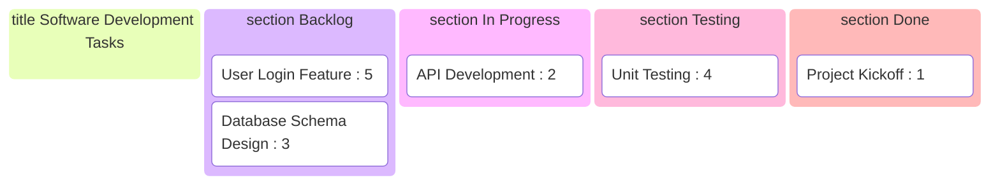
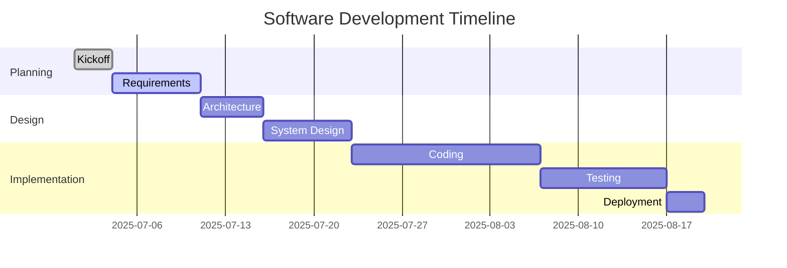
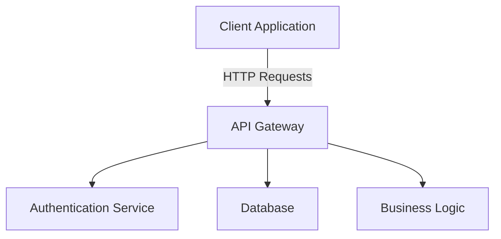
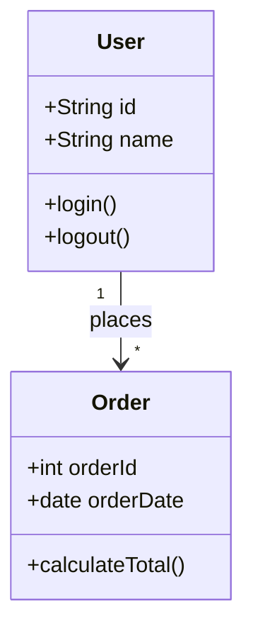
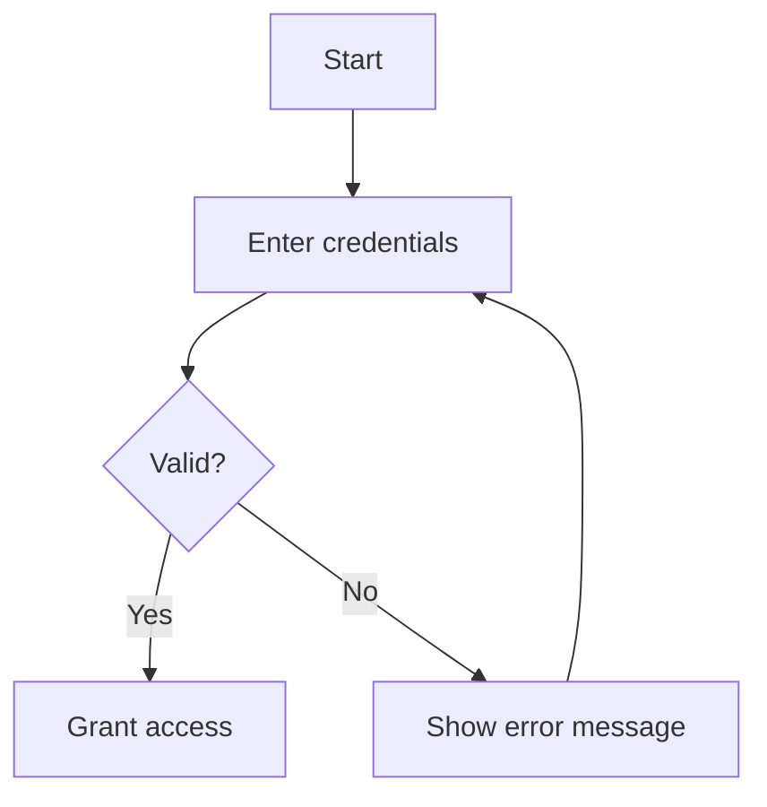
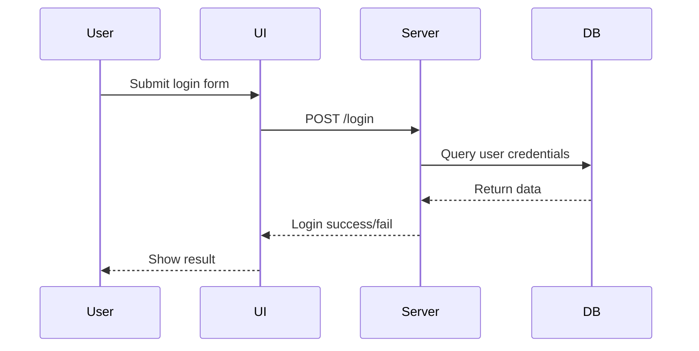

# 1. Lecture Notes

# Lecture: Using Diverse Mermaid Diagrams for Software Design & Development

---

## 1. Introduction to Mermaid

- Mermaid is a text-based diagramming tool supporting multiple diagram types:
  - Flowcharts, Mindmaps, Class diagrams, Sequence diagrams
  - Requirement diagrams, Kanban boards, Gantt charts
- Using the right diagram type clarifies communication in software projects.

---

## 2. Project Kick-off: Mindmap Diagram

```mermaid
mindmap
  root((Project Kickoff))
    Stakeholders
      Developers
      QA
      Product Owner
    Goals
      Scope Definition
      Timeline Planning
      Risks
    Resources
      Budget
      Tools
      Team
````

*Mindmaps help brainstorm scope, stakeholders, and goals.*

---

## 3. Requirements Gathering: Requirement Diagram (7 min)

```mermaid
requirementDiagram
  requirement req1 {
    id: R1
    text: "User login must be secure"
    risk: high
    verifymethod: test
  }
  requirement req2 {
    id: R2
    text: "System must handle 10,000 concurrent users"
    risk: medium
    verifymethod: test
  }
element test_req1 {
    type: Manual Test
    }
element test_req2 {
    type: Performance Test
    }

  test_req1 - satisfies -> req1
  test_req2 - satisfies -> req2
```

*Shows requirements, risks, and verification methods.*

---

## 4. Project Planning: Kanban Board



*Visualizes task progress in an agile workflow.*

---

## 5. Timeline Planning: Gantt Chart



*Shows timeline, durations, and dependencies.*

---

## 6. System Architecture: Flowchart



*Communicates system components and interactions.*

---

## 7. System Design: Class Diagram



*Models data objects and relationships.*

---

## 8. Workflow Design: Flowchart



*Visualizes decision points and process loops.*

---

## 9. Interaction Design: Sequence Diagram



*Models message flow over time between components.*

---

## 10. Summary & Best Practices

* Match diagram type to purpose for clarity.
* Use mindmaps & requirements early.
* Kanban and Gantt for planning.
* Flowcharts & class diagrams for design.
* Sequence diagrams for interaction flows.
* Embed Mermaid in docs for maintainability.
* Keep diagrams simple, clear, and modular.

---

## 11. Q\&A
